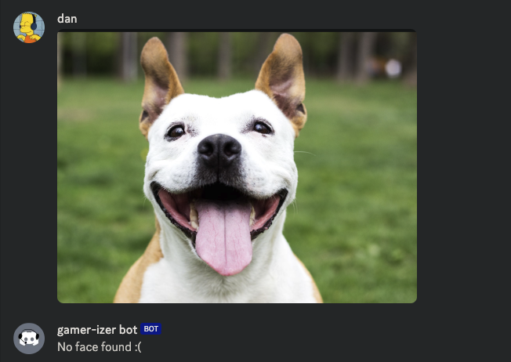

# Discord headphones bot
TL;DR - Add headphones to a picture's face(s) to learn more about facial recognition (through ML) and mess with Discord's API.
This repo has the docker setup to run on a hosted server as well as some testing notebooks

### Context
In a group of people I game with, if someone sends a picture, someone else typically adds on some headphones to make it look like the person is gaming. This Discord bot will add headphones for us.

### Approach
Finding ears is pretty tough through models, but finding eyes, chin, and some other landmarks is easier. Since we want the headphones to be unrealistic anyways, we can make an assumption the chin line is close to the head shape, flipped. We can guess the ears are at the top landmarks of the chin line, and that the microphone line should be from an ear (left ear for example) to the mouth, halfway between the chin line.

### TODO
- Train a model to find ears
- Erase parts of the headphones that shouldn't be visible because of the face's orientation

---
### Example
Input image

Landmarks found

Flip jawline to be headphones, add in over-the-ear parts and mic

---
### Multiple faces

Pretty easy to implement

---
### No (human) faces found
Still let the users know we tried

---
### Full flow

